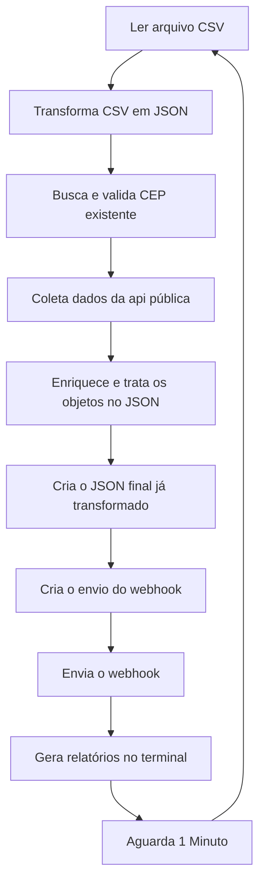

# Automação com API REST

## Sobre o Projeto
Este projeto consiste em um script de automação desenvolvido para processar e enriquecer dados de forma automatizada.

O script realiza a leitura dos dados de um arquivo CSV, transforma essas informações para o formato JSON e realiza o tratamento dos dados. Em seguida, consome uma API pública para obter dados adicionais. As informações relevantes retornadas pela API são combinadas com os dados originais, gerando um novo arquivo JSON com os dados consolidados.

O objetivo dessa automação é reduzir tarefas manuais e repetitivas relacionadas à consulta.

## Decisões técnicas
 - A biblioteca `csv-parse` foi utilizada para realizar a leitura e conversão dos dados do CSV.
 - Os erros são registrados separadamente no arquivo `erros.json`.
 - Os registros são processados individualmente para que falhas em um CEP não interrompa todo o processamento.
 - A automação é executada a cada 1 minuto utilizando o `setInterval`.
 - O webhook é enviado após cada ciclo de processamento para simular uma notificação ao time.

## Limitações Conhecidas
 - A automação depende da disponibilidade da API ViaCep
 - Caso o arquivo `consulta.csv` não existir ou nõa possa ser lido, o `escreverJson()` lança erro e aí não existe uma “próxima unidade” para continuar, porque o script nem conseguiu carregar a lista.
 - O formato das colunas do CSV deve seguir o esperado pelo script.
 - O processamento dos CEPs é sequencial, portanto arquivos muito grandes podem aumentar o tempo de execução.
 - O arquivo `consulta.csv` deve estar no diretório raiz do projeto.

## Fluxo de Processamento dos Dados



## Tecnologias Utilizadas
 - JavaScript
 - Node.js
 - JSON
 - Webhook

## Como utilizá-lo

Caso não tenha o Node.js instalado, será necessário baixá-lo
```
https://nodejs.org/pt-br/download
```
Com o node instalado, clone o repositório utilizando o link abaixo
```
https://github.com/joaogadev/Automacao-com-API-REST.git
```
Para a solução funcionar será necessário conferir se o ```type``` está selecionado como ```module``` da seguinte forma:
```
"type": "module"
```
Após clonar, abra o repositório e utilize os seguintes comandos:
```
npm install
```
```
npm install csv-parse
```
Será necessário gerar uma URL no site abaixo
```
https://webhooktest.net
```
para acompanhar os dados tratados da automação. Para fazer isso, acesse o site, clique na opção 
```
Create Webhook endpoint
```
Copie o endpoint do webhook
No código ```automacao.js``` substitua o link existente pelo link copiado.
Confira se o ```consulta.csv``` está localizado no mesmo diretório do ```automacao.js```, caso não esteja, coloque-o.
Após finalizar esse passo a passo, abra o terminal e insira o comando
```
node automacao.js
```

### Qualquer dúvida que surgir, entre em contato.