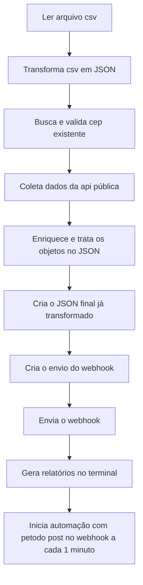

# Automação com API REST

## Sobre o Projeto
Projeto de automacao com o objetivo de carrega os dados de um CSV, transforma-los em JSON, trata-los, consumir uma api publica, utilizar os dados desejados nela e adiciona-los em um novo JSON com os novos dados da API pública junto dos dados desejados do antigo CSV.

## Fluxo de Processamento dos Dados



## Tecnologias Utilizadas
 - JavaScript
 - Node.js
 - JSON
 - Webhook

## Como Utiliza-lo

Caso não tenha o node baixado será necessário baixar no link abaixo
```
https://nodejs.org/pt-br/download
```
Com o node instalado, clone o repositório utilizando o link abaixo
```
https://github.com/joaogadev/Automacao-com-API-REST.git
```
Para a solução funcionar será necessário conferir se o ```type``` está selecionado como ```module``` da seguinte forma abaixo:
```
"type": "module"
```
Após clonar, abra o reporitório e utilizie os seguintes comando:
```
npm install
```
```
npm install csv-parse
```
Será necessário gerar uma url no link 
```
https://webhooktest.net
```
para acompanhar os dados tratados da automação. Para fazer isso, acesse o site, clique na opção 
```
Create Webhook endpoint
```
Copie o Webhoo endpoint
No código ```automacao.js``` altere o link posto pelo seu lisk copiado
Confira se o ```consulta.csv``` está localizado no mesmo local do ```automacao.js```, caso não esteja, coloque-o.
Após finalizar esse passo a passo, abra o terminal e insira o comando
```
node automacao.js
```

### Qualquer dúvida que surgir entre em contato